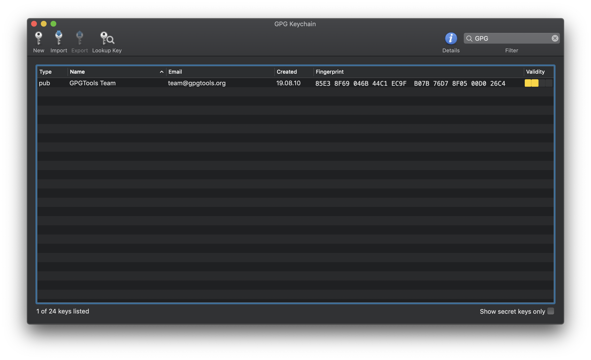
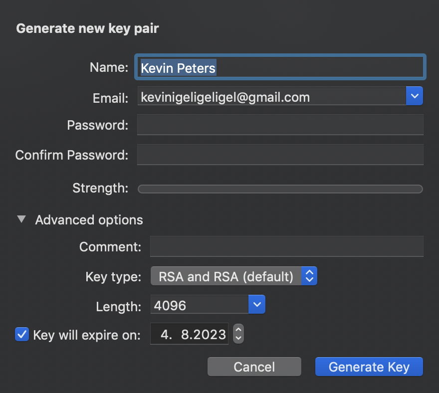
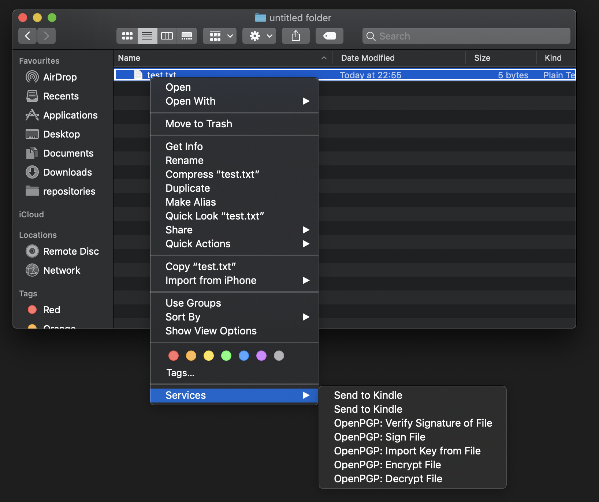

# How to share files securely with GPG suite

In every company, files are shared in some kind of way. When customer data is involved this process is becoming security-relevant.

Imagine a CSV file to be shared which is looking similar to this:

| userId | firstName | lastName |              email              |
| ------ | --------- | -------- | ------------------------------- |
| 2      | Jo        | Hardy    | johardy@kevinpeters.net         |
| 4      | Todd      | Davis    | todddavis@kevinpeters.net       |
| 9      | Shannon   | Guenther | shannonguenther@kevinpeters.net |
| 34     | Sheila    | Medina   | sheilamedina@kevinpeters.net    |

This file includes a lot of private customer data which should not be shared to 3rd-party software. In normal cases, this file is then shared on the company internal slack. When not encrypted, then Slack will have access to the file in one way or the other. This can be dangerous and that is why files should be encrypted. There is a solution for this on macOS though which is called GPG suite. Before using the tool we should understand how the techniques used by this program are working.

GPG stands for "The **G**NU **P**rivacy **G**uard". It is an implementation of the OpenPGP protocol which implements the standard RFC4880.

This standard is an implementation of private-public-key encryption. To explain this procedure an own blog article would be needed but there are a lot of resources out there which can be used. The best explanation which I have found is this video:

<iframe width="560" height="315" src="https://www.youtube.com/embed/YEBfamv-_do" frameborder="0" allow="accelerometer; autoplay; encrypted-media; gyroscope; picture-in-picture" allowfullscreen></iframe>

It explains the concept quite well and we can see that both of the participants need to have a private key to make the encryption work, but no stress - this will be solved by GPG Suite.

## GPG suite setup

First, you need to download the program on your Mac. You can find the installer on the homepage: https://gpgtools.org/

After you have gone through the installation, you will see a screen with a list which has exactly one key. You can ignore this key because it is not relevant at all.

As we have learned in the video from before we need a private key. To generate this key, you just need to press on new on the upper right. In the following menu just type in your name, the email, make sure to not type a password (you do not need this) and unset the expiration date. This assumes your machine is safe and you will never have a problem. If you lack security I recommend setting a good password.

After this, you can find your key in the list. As we have learned in the video we need to share our public key somehow. This is quite easy. You can right-click on the key in the program and you have several options to share the key. The easiest is to export it as a file and send it to the other person on Slack. And no worries. The public key can be shared (a `.asc` file). You should never ever share your private key! After sharing your public key with your colleague he needs to follow the same procedure and send you their public key. You can open the document and copy the content and the program will automatically import the public key or you import it by opening GPG suite and press on "Import" on top.

## Encrypting files

After both participants have imported the public key of the other person, you can start encrypting the file. This is also super-easy. Just open your finder. Right-click the file and go to Services -> OpenPGP: Encrypt File. After this select the receiver of the files. The program will then encrypt the files and you will receive a file called like `test.txt.gpg`.

A cool lifehack is also that GPG suite supports selecting multiple files. It will zip those files first and then encrypt them. The default name will be `Archive.zip.gpg`.

The resulting file can then be shared with the colleague. No one except both participants can decrypt the file. GPG suite is automatically decrypting the file on download but you can also manually decrypt it by using the context menu again and selecting OpenPGP: Decrypt File instead. Another option is to double click on the `.gpg` file. This will also decrypt the file.

## Conclusion

You should check out GPG Suite if you have not already. It makes working with PGP keys super easy and the user experience is just top-notch 👌. In the future, your company could look for a central key server to share keys. This would make sure that public keys are not shared via the Internet like Slack but stay in the company's system.

Another good approach is to share those public keys via [keybase.io](https://keybase.io/).

But most importantly, Share your files securely 🐱‍💻!
