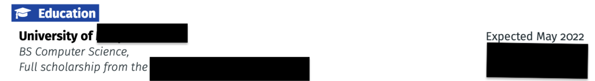
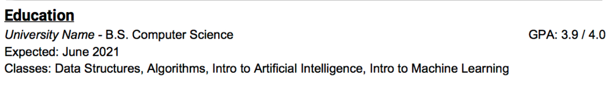
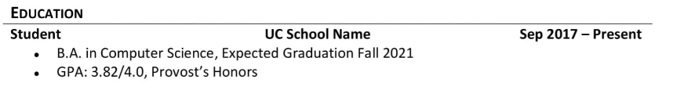

# Showcasing your Education Perfectly in a Resume

Education is important. But when entering the job market, formal education in your life is just a small indicator for any business. In the end, a business cares about how much you can contribute to the company to make them a profit. An employee should always get paid less than they make for the business. Unfortunately, that is the case in this scenario. The better the education of the employee is, the better the performance is. That is at least what most people think. The reality is that high-performers do not necessarily correlate to their education. They have better chances to be high-performers and get better job opportunities, but in the end, the experience and expertise in their domain are important.

## What to list under Education?

A difficult step is what to list under the education section of the resume. As explained earlier in this article, the education section should be short and list just relevant information. For example, if you are applying for a job after your university or college degree, then it might not be worth it to list that you had a specific high-school program. The requirement is to list the latest education that is relevant to the position you are applying to. If the degree or education is not relevant, you can still list it but hide the information like what the final thesis was about. Just keep it short.

Otherwise, you should always list the degree you have studied for, the location where you studied, and list the university or college. In the next line, list the title of your thesis if it applies, and maybe, additional achievements can be listed as well. These additional achievements mostly consist of leadership in various groups and projects showcasing your engineering proficiency. What should not be listed is generic courses or coursework that does not have to do anything with Software Engineering. Just leave them out.

## Where to list Education?

Another critical point is where to list the education section in the resume. That highly depends on your experience and the school you went to. As a fresh graduate without any work experience and mediocre projects, it is worth to list the education section as one of the first sections in the resume. The more experienced you get through projects or real work experience, the less important your education gets. In the end, companies want to see how you can contribute value to them. Having a good education sets the base for good work, but the real difference is what you contribute to the job. Another scenario occurs when you have an extraordinary grade in your degree (GPA) or when the university or school is widely known. For example, MIT or ETH Zürich are cases like this where education can be listed on top comfortably if you do not have full-time work experience. Degrees from these schools are highly desired after, and the general population knows that these universities are the best of the best.

Otherwise, the education section gets less and less important after your first job. Typically you will stay one to three years at your first job, and after this first job, your future employers are more interested in what you did in your first job rather than in your studies. You should focus on the achievements in there and put it before the education section and on the top of the resume. The more time spent in jobs, the less important your education gets, and the lower it should be listed because, at some point, it is just a side-effect. After four years of experience in the job market, just list the education at the end of the resume with two lines maximum. Achievements in your workplace are far more important.

## What about informal Education?

Informal education includes the following things:

- Volunteering in organizations related to the job
- Certificates gained for technologies
- Completion of online courses

With most of these things, the problem is that the technologies, methodologies, and processes are not used in real-world scenarios. So will it add real value? Probably not. If the job description explicitly requirements certificates, then you can list them. But in general, they do not add that much value to the existing resume. You should concentrate on working on projects, and if you have it already, your job or internship. These achievements will outweigh education by far.

## Should I list my GPA?

Listing your grading is dependent on the grade itself. If you got an exceptional grade, then you should list it. That applies to your thesis, as well. If the topic kind of fits the job and the grade of the thesis are good, it is recommended to list the grade. In general, you can list the grade if it is better than 3.0/4.0. That is the American scale of grading. There are several converters online that you can use to transform your local grade into the American version. If your grade is just worse than this value listed above, just leave the grade off. No one will ask, and you still have the degree. Try to shine in other categories like personal projects or internships and previous job experience instead.

The grade also gets less critical, the longer you have worked. In theory, it does not matter after the third first or second year of work experience which grade you have achieved. Traditional companies might look at the grade, but in general, companies do not care. If you still had a really good grade, you can, of course, list it.

## Some Examples

Now that all the elemental things are explained regarding the education section, we can start looking at examples on what to improve and how good education sections can look like. All of the examples are from resumes that were copied from a Reddit called cscareerquestions. In this subreddit, there is a post twice per week where everyone can post their resume for feedback. If you seek feedback, I recommend you posting an anonymized version of your resume there. The feedback is quite objective, but also harsh. That is good in the end since you will get honest feedback.

### Example 1

The first example shown in this case is quite solid. It lists the university, when graduation is expected, and the degree. No thesis or similar things are given, so this is almost perfect. Since the graduation is far away from now (September 2020) it is also expected to not list too many things regarding the degree. I would recommend deleting the full scholarship description. It shows the student is skilled but does not mean they have achieved anything except good grades in school. If the university is not one of the biggest ones, leave fluffy stuff like this. It might be worth more to describe a project impacting the scholarship in any way under the project description if it fits the software engineering domain. Overall, a solid education section.

### Example 2

The second examples show a really good Education section. I would bring it down to three lines overall. The expected graduation date can be listed in the first line of the content. The list of classes is kind of unnecessary for Data Structures and Algorithms because most computer science students must take these classes. Special classes like lessons regarding Artificial Intelligence can be relevant to list when you apply to Machine Learning positions. Overall the education section in this example is quite strong, so it can be even listed on top.

### Example 3

The third example is quite a good example. The GPA could be listed on the content line as well to make it a bit shorter, but otherwise, it is also quite a good education section. Nothing to add basically.
