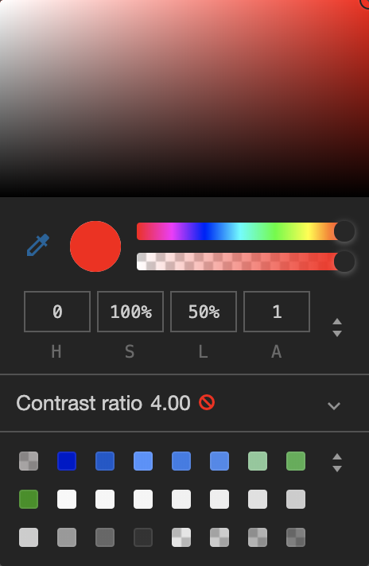
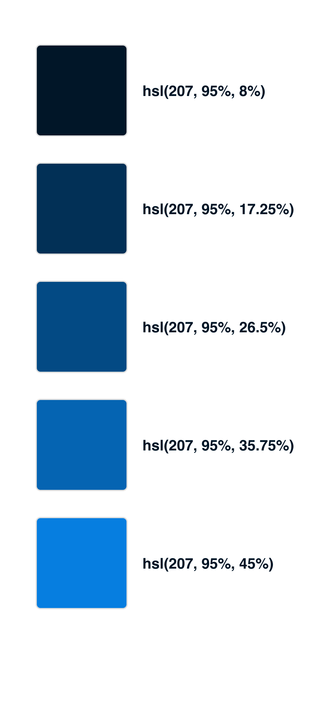
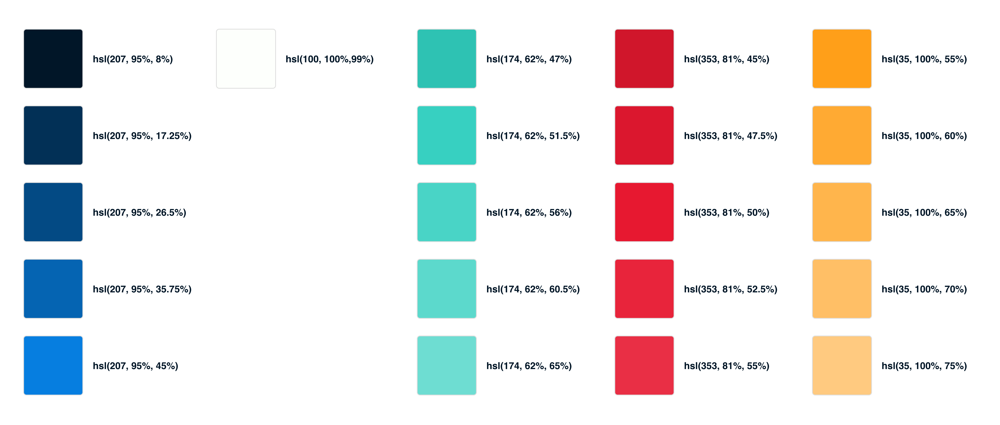

# Generating color schemas as developer: A simple guide

As a full-stack software engineer or frontend engineer, someone might be exposed to design decisions sometimes. Ranging from small design decisions in early-stage startups to creating own projects, it might be needed some time to choose colors for different user interface (UI) elements. This guide should help you choose the optimal colors for a project if no colors have been defined or given to you.

First of all, most base colors can be copied from a lot of popular sites or taken from the sites presented in the next chapter. The populated color schemas will work well for most of the web applications you will create and will generate outstanding designs.

## Popular Color Schema Sites

On the internet, a lot of color schema sites popped up in the last years. Most of them are curated and can be taken as a good base for your own needs. A bad thing about the sites is that most of them are showcasing just five colors and for most applications, this is not good enough. Engineers normally use opacity for different color shades but working with different background colors might result in different results. A yellow with an opacity of `0.8` might look different on a black and white background.

You can see in the middle and on the right how the base color from the left looks with a white background and with a black background. The colors are just completely different and it shows you should not use this pattern to create color shades. To discover the base color we can use one of the following color schema sites.

### coolors.co

[coloors.co](https://coolors.co/) is probably the most popular website to find color schemas. It is mostly praised as a generator but what let the site shine is the explorer or browsing menu. The [picks](https://coolors.co/browser/picks/1) and the [best](https://coolors.co/browser/best/1) search filters offer a wide variety of really good color schemas.

### colorsandfonts

[colorsandfonts](https://www.colorsandfonts.com/) is quite a newcomer when it comes to design resources. But it shines with detail in design and nice showcases. The color palettes you will find on the website are quite well-differentiated and look nice. The palettes can be found [here](https://www.colorsandfonts.com/palettes.html).

## The problem with the color palettes

Most often the color palettes provide a good base for colors but just five colors might be limited most often for elements. A button border which should have mostly the same color but just a bit different when it is focused. The following picture shows the problem if we would use opacity.

The button works great on a white background but on a dark background, it loses its touch.

Instead, we can generate a new color for the border which would work on a dark and bright background as the following picture suggests.

The color of the border of the button is more consistent on this picture and the right since the color is not transparent at all. To generate colors like this, we need to learn first about HSL values which are explained in the next chapter.

## Use HSL instead of Hex

Web developers are mostly using hex codes for colors. But the hex color codes are bad to design with, unfortunately. Instead, there is the concept of HSL. It stands for:

- **H**ue: Is a degree on a color wheel. It goes from 0 to 360.
- **S**aturation: Goes from 0% to 100%. 0% is the color just grayed out.
- **L**ightness: Goes from 0% to 100%. If you set it to 100% the color will be white. If the value is set to 0% the color will be black.

You can observe the HSL colors quite good in your browser dev tools. On Mac on Chrome just open the dev tools with CMD+Option+J. Afterward, adding `color: hsl(0, 100%, 50%);` to some element will probably set you up to use the color picker in Chrome or Firefox.

Just enter the `S` (saturation) input box which is set to 100% in the example and play around with your up and down arrow keys. You can see where the circle in the color picker is going. When putting the saturation back to 100% and changing the 50% value with the up and down arrow, someone can feel how lightness is changing the color.

## Generate Shades of Colors

After learning how HSL is working, different color shades can be created. It is quite simple. Starting with a [popular color schema from coolors.co](https://coolors.co/011627-fdfffc-2ec4b6-e71d36-ff9f1c) we choose our base colors which are:

- hsl(207, 95%, 8%)
- hsl(35, 100%, 55%)

Now, opening another tool called [Color Shade Generator](https://superdevresources.com/tools/color-shades#011628), we can see that different color shades have been generated already. Since the base color which was chosen is so dark already we go with a lot lighter color. I chose the color `hsl(207, 95%, 45%)` now which fits our needs somehow. Now we have two colors, a dark one which is `hsl(207, 95%, 8%)` and a bright one which is `hsl(207, 95%, 45%)`.

We can see that just the last number in the HSL code changed which is the lightness. From now we can either build 5, 7 or 9 colors between those shades to get to different colors which can be used as a base color schema. I like to build 9 shades of colors for every base color. In this example, we will build 5 though. Starting this is quite easy. Taking the darkest color `hsl(207, 95%, 8%)` and the brightest `hsl(207, 95%, 45%)`, we try to select the middle color for both colors. It is quite easy since the calculation is just `(45% + 8%) / 2` which is `26.5%`. Inserting this now into the HSL we receive the color `hsl(207, 95%, 26.5%)` which is kind of fitting into the color shade for now.

Now that this works we can follow up with the colors which are missing. The same rule can be applied here as well. The colors are calculated now in the same way. The upper color is calculated by using `(26.5% + 8 %) / 2` which is `17.25%`. And the lower color is calculated by `(26.5% + 45%) / 2` which is `37.75%`. In the end, a color schema like in the following picture should have been created.

Those tones are blue are now the only blue colors the web application ever needs. In theory, these can be saved somewhere in a project as variable already and used throughout the CSS, [SCSS](https://sass-lang.com/documentation/syntax) or JS in CSS styles like [styled-components](https://www.styled-components.com/) or similar.

This procedure can be applied to all colors of the base color schema now.

## Also design State Colors

An important part of every design is state colors. Green, Yellow and Red are the most common colors to indicate a state in some form. For these colors, a software engineer should also design colors. These colors are included in most of the color palettes already but every color palette needs a lot more shades for making it possible to create designs which are fitting the web application. This means that also for these colors the shades have to be generated as mentioned in the last chapter.

For the [base color schema](https://coolors.co/011627-fdfffc-2ec4b6-e71d36-ff9f1c) which was used throughout this whole guide, the color palette would look like the following image.

## First design without Color

An important procedure to follow during designing as a non-designer is to create the mockups first without colors. Designing the wireframe without colors will help to make the general structure of the design working. Colors should be added as a way to focus on certain things and give the users some hint on how to use the designs. But the overall structure of the design should be influenced by the layout and choosing the right components first.

## Resources

- Figma resource: https://www.figma.com/file/Yn0ta0mGXP6MBgrIKMHiev/generating-color-schemas-as-developer-a-simple-guide
- Base color schema: https://coolors.co/011627-fdfffc-2ec4b6-e71d36-ff9f1c
- All colors as JavaScript Variables: https://gist.github.com/igeligel/fb6d630597b3c900634206035327919c
